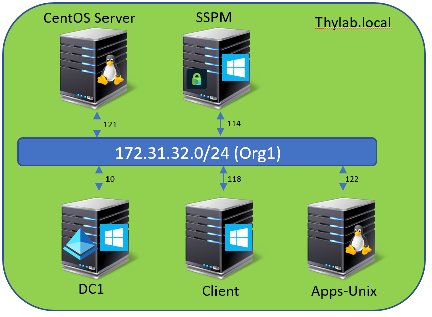
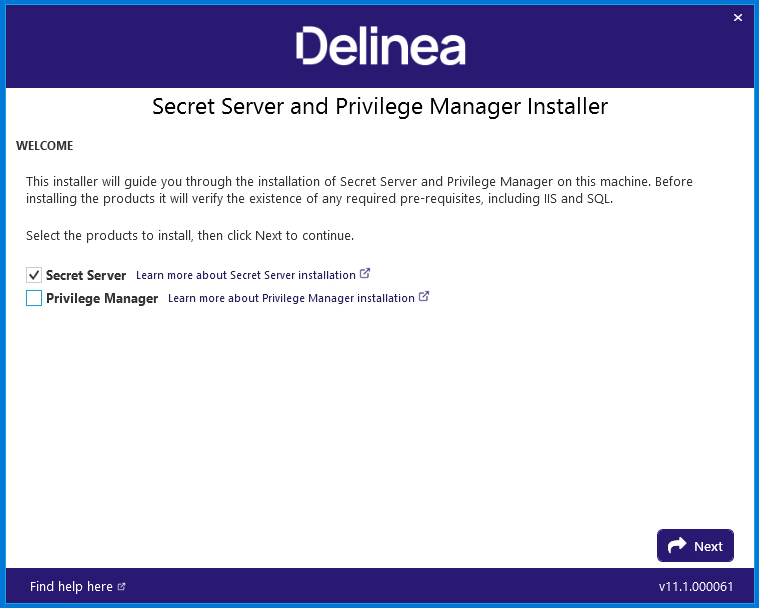
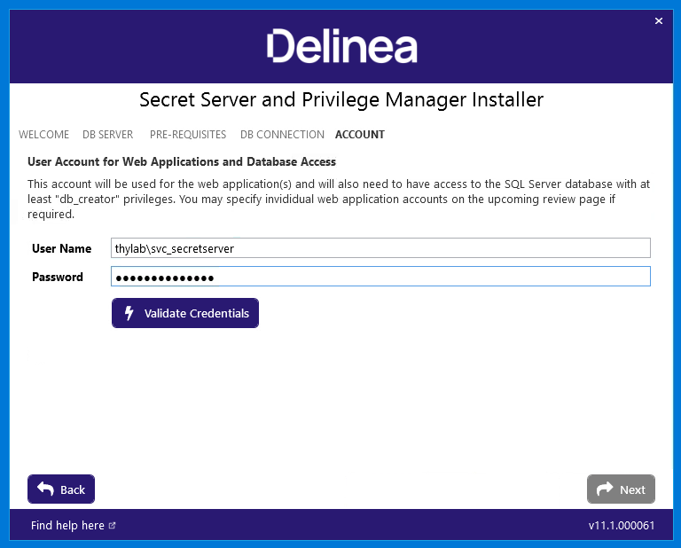
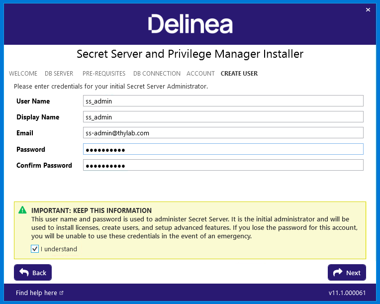
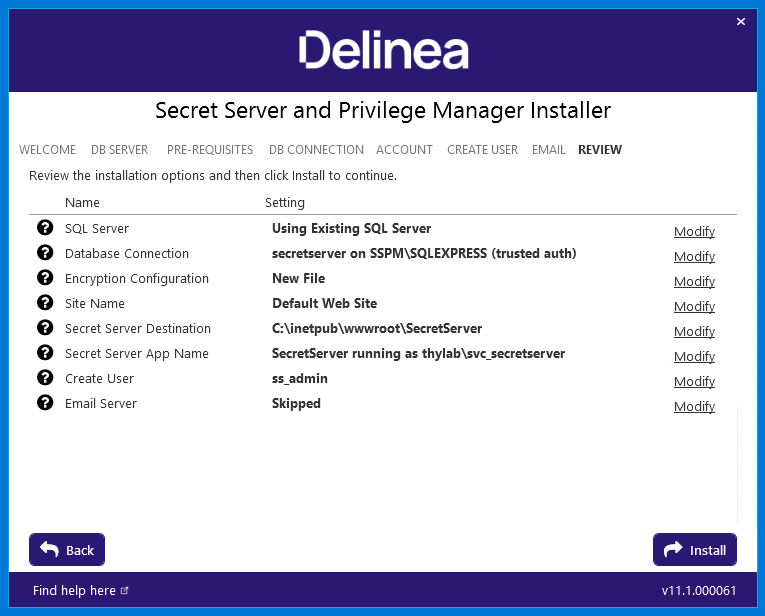

# Installing Secret Server

## Introduction

This first module will cover:

1. What are the Secret Server components?
2. What are the pre-requirements (minimum and recommended)?
3. What ports does Secret Server use?
4. Lab exercises
5. Managing the Secret Server encryption key

### Secret Server components

- Front end ASP.NET web Application
- Back end SQL database

### Pre-Requisites

**Minimum Requirements - Basic Deployments**

| Web Server | Database Server | 
|------------|-----------------|
| 2 CPU Cores | 2 CPU Cores |
| 4 GB RAM | 4 GB RAM |
| 25 GB Disk Space | 50 GB Disk Space |
| Windows Server 2008 R2 SP1 or newer | Windows Server 2008 R2 SP1 or newer |
| IIS 7 or newer |SQL Server 2012 or newer|
| .NET 4.5.1. or newer | |

!!!Note
    SQL Express is supported but not recommended for production environments


**Recommended Requirements - Basic Deployments**

| Web Server | Database Server | 
|------------|-----------------|
| 4 CPU Cores | 4 CPU Cores |
| 16 GB RAM | 16 GB RAM |
| 25 GB Disk Space | 100+ GB Disk Space |
| Windows Server 2008 R2 SP1 or newer | Windows Server 2008 R2 SP1 or newer |
| IIS 7 or newer | SQL Server 2012 or newer |
| .NET 4.6.1. or newer | |

!!!Warning
    For advanced deployments where discovery, session recording or increased numbers of distributed engines are being used, please see feature specific knowledge base guides for detailed requirements.


### Ports used by Secret Server

The table below identifies ports and/or port ranges that may be required by Secret Server

| Process | Type of traffic | Port number/range |
|---------|-----------------|-------------------|
| Active Directory | LDAPS | 636 |
| | LDAP | 389 |
| | Kerberos | 88 |
| | NTLM | 445|
| Discovery| RPC Dynamic Port Range* | 49152 - 65535|
| | Microsoft DS | 445|
| | Epmap | 135|
| | SSH | 22|
| Remote Password Changing | RPC Dynamic Port Range* | 49152 - 65535|
| | SSH |22 |
| | Telnet | 23 |
| | MS SQL | 1433|
| | NTLM | 445 |
| | LDAP | 389 |
| | LDAPS | 636 |
| | Sybase| 5000 |
| | Oracle | 1521|
| | Kerberos | 464|
| Ports Incoming to Webserver | HTTP | 80 |
| | HTTPS | 443 |
| Ports Incoming to Database Server| SQL Connection TCP and UDP| 1433|
| Email | SMTP | 25 |
| RADIUS Server | RADIUS|  1812|

!!!Remark

    The RPC Dynamic Port ranges are a range of ports utilized by Microsoft's Remote Procedure Call (RPC) functionality. This port range varies by operating system. For Windows Server 2008 or greater, this port range is 49152 to 65535 and this entire port range must be open for RPC technology to work. The RPC range is needed to perform Remote Password Changing since Secret Server will need to connect to the computer using DCOM protocol.

To see your ipv4 dynamic range on a given machine, type 

`netsh int ipv4 show dynamicport tcp`

 in the commandline.

To specify a specific port on your environment that Secret Server will communicate to, you can also 

[enable WMI ports on Windows client machines](https://thycotic.force.com/support/s/article/Enabling-WMI-ports-on-Windows-client-machines).


### Lab 1 – Connecting to the lab environment

In this exercise you will access the Delinea training lab environment.

1. Navigate to the URL of the training lab environment provided by the training team.

2. Enter the password: *Provided by the trainer*

3. You will now see all VMs in the lab in a suspended state:

    

4. Click the power icon above the VMs to power them on, once powered on you can access each VM by clicking into the screen icon

    !!!Note
        The labs have a default keyboard layout of UK English, you might want to select a different keyboard language in the Skytap toolbar and in Windows.

The environment looks like this



### Lab 2 – Installing Secret Server

In this exercise you will power on and connect to the training lab environment before running through a complete installation of secret server.

01. Initiate a connection to **SSPM** by clicking the machine in the Lab environment

02. Login using the credentials **thylab\\adm-training** / *Provided by the trainer*

03. On the desktop of the SSPM machine you will see the secret server installer executable:

    

04. Run the setup file, when prompted with a windows User Account Control (UAC) dialogue click **Yes**

05. The installer can install both Secret Server and Privilege Manager (Delinea endpoint least privilege solution). In this case we only want to install Secret Server so uncheck the Privilege Manager radio button as in the image below:

    

06. Click **Next**

07. On the SQL Server Database screen we can either install SQL server express or connect to an existing database. In the lab environment SQL Express is already installed so select **Connect to an existing SQL server** then click **Next**

    

08. The installer will now perform a range of checks to ensure pre-requisites are in place. In the lab environment all requirements should be in place, click **Next**

    

09. On the next screen we need to configure the database connection. As the SQL server is installed on the same machine, in the Server name or IP field enter: **SSPM\\SQLEXPRESS** in the database name field, enter: **secretserver**

10. On the same screen we now need to configure the authentication option that will be used to connect to the database. Although we can use SQL authentication or Windows authentication here, Delinea recommend using Windows authentication. Select the **Windows Authentication using service account** radio button and click **Next**

    

11. On the next screen we will be asked to configure the service account that will be used to connect to the SQL database and used to run the IIS application pools. Enter the following credentials:

    - username: **thylab\\svc_secretserver**
    - password: **\*Provided by the trainer\***

12. To ensure the credentials are correct, click **Validate Credentials**, if they are you should see the word **Success**. If not, check the credentials for any errors. Click **Next**

    

13. On the next screen we need to create our initial Secret Server user. At this point you can create your own user or use the following information to create the initial user:

    - **Username:** ss_admin
    - **Display name:** ss_admin
    - **Email:** <mailto:ss_admin@thylab.com>
    - **Password:** *Provided by the trainer*
    - **Confirm Password:** *Provided by the trainer*
){danger}
    If you create your own user account at this point, ensure you remember the username and password. This account (ss_admin) is used for the initial administration of Secret Server.)

14. Confirm you understand the importance of not loosing these credentials and click **Next**

    

15. On the next screen, options to configure an SMTP mail server are available. This feature will not be used during the training so click **Skip Email**

    

16. In the overview page, click **Next**

17. The next screen provides a review of configured installation options and the option to modify any options if required. Click **Install**

    

18. The installation process may take up to 10 minutes. A great time to get something to drink...

19. Once the installation is complete, you can now log in to Secret Server using the: <https://sspm.thylab.local/secretserver> URL.

    

20. click **Close**

### Managing the Secret Server encryption key

The Secret Server database is encrypted using a master encryption key. Each individual secret stored in the database is then encrypted with an intermediate key. When Secret Server is first installed the master encryption key is available in plain text and stored in the following location:

```bash
C:\inetpub\wwwroot\SecretServer\encryption.config
```

In the next module we will be protecting this encryption config file as part of the security hardening of Secret Server. At this point, Delinea recommend taking a copy of this master encryption key and storing it in a physical vault for disaster recovery purposes. In a worst-case scenario it is possible to recover the Secret Server database and all secrets with a valid database backup and the master encryption key.

!!!Danger
    Delinea does not keep copies of customer encryption keys

