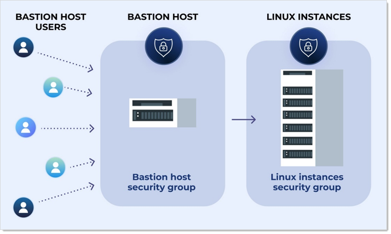
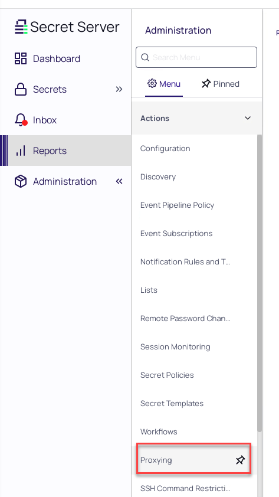
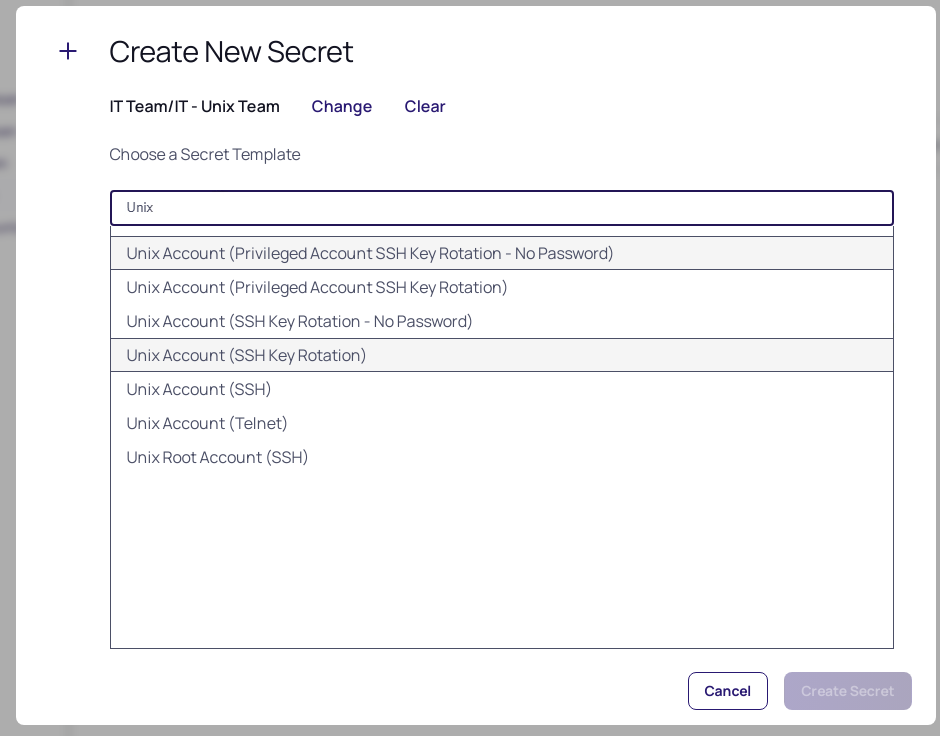
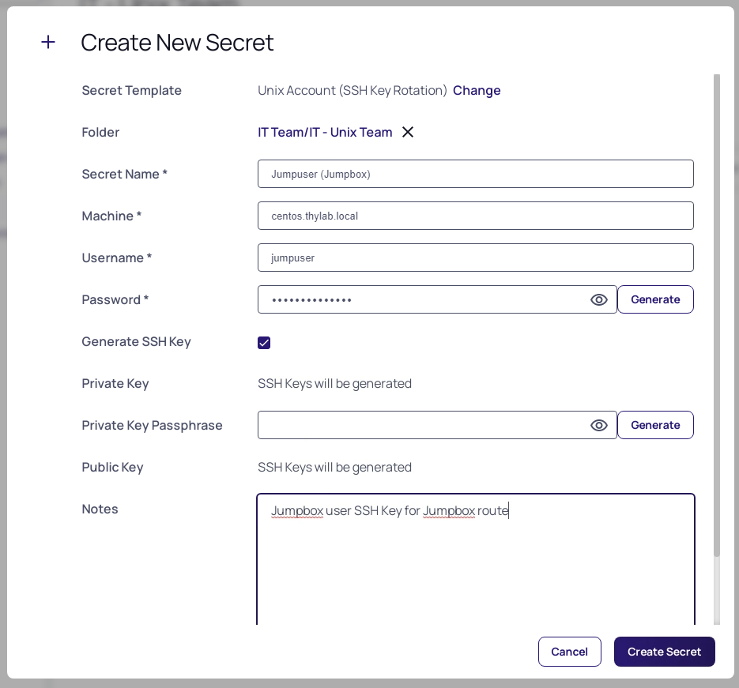
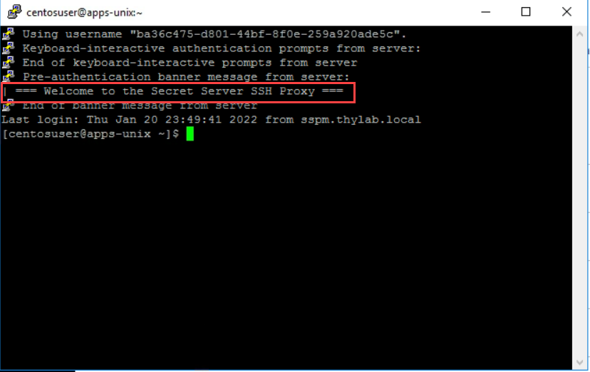
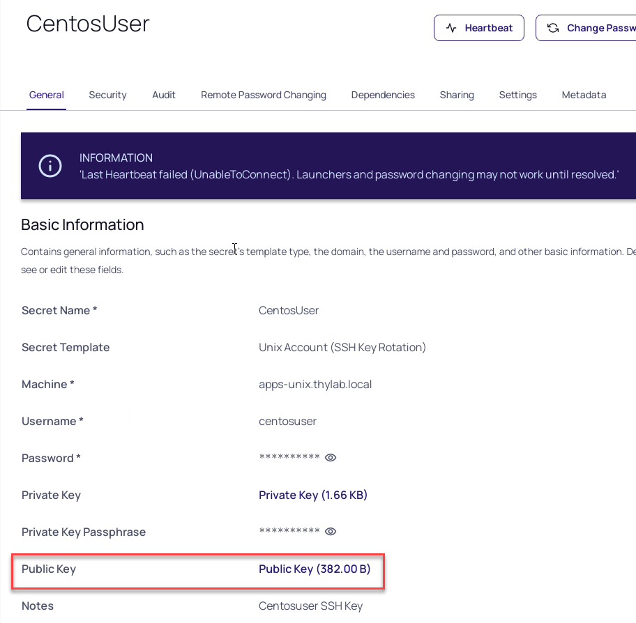
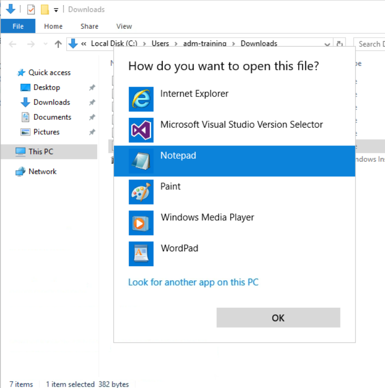
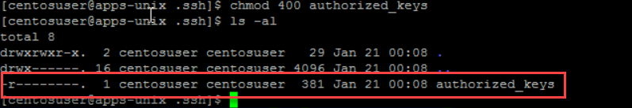
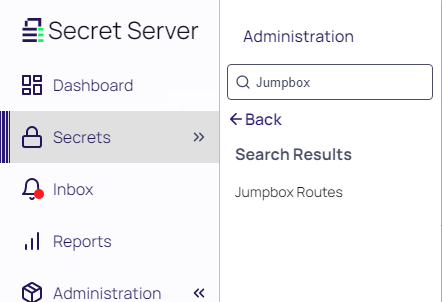
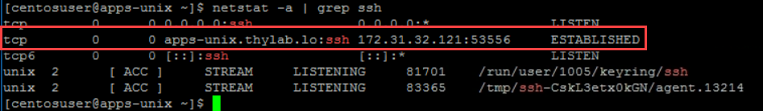

# SSH JumpBox

## Introduction

This eleventh module will cover:

1. Setting up SSH Proxy
2. Secrets creation
3. Prepare Linux machines
4. Create Jumpbox Route
5. Use the Jumpbox route

## SSH Jumpbox overview

An SSH jumpbox route, is a series of regular Linux servers, accessible from the Internet, that is a gateway to other Linux machines on a private network using the SSH protocol. This topic and its subtopics address discuss using jumpbox routes.

Note: SSH jumpboxes are also called bastion hosts, jump hosts, or jump box servers. Bastion is a military term meaning a projecting part of a fortification. Bastion hosts are hardened and monitored servers that reside outside of an organization’s security zone, usually exposed to the internet. All jumpboxes are bastion hosts, but all bastion hosts are not necessarily jumpboxes.

Because SSH jumpboxes usually reside on the Internet, they run a minimum of services to reduce their attack vulnerability. Similarly, limiting the Internet access to your infrastructure to one hardened gateway server also reduces risk. In addition, a dedicated SSH access point makes it easier to have an aggregated audit log of all SSH connections.

With early SSH, users had to SSH into a jump host and then type ssh again to manually jump to a destination host. Today, this is done automatically using the built-in SSH -J ProxyJump option.

Secret Server can now create a chain of jumpbox secret connections to reach an otherwise inaccessible Linux instance. This sequence is called a jumpbox route and can contain up to 20 jumpbox levels (hops between instances).

In the lab environment there are two CentOS servers ready to be used for this. CentOS server and apps-unix. As there is no AWS client available the lab will emulate the ssh jumpbox by using the CentOS server as the jumpbox towards the apps-unix server.

### Configure SSH Proxy

One of the reasons why SSH/RDP Proxying is used, is that the use of the proxy is more secure due to the fact that the secrets will NOT reach the endpoint. Instead the secrets are "translated" to have a temporary username/password combination that will be accepted by the endpoint. To be able to use a jumpbox and jumpbox routes, Secret Server Proxying must be enabled and configured.

1. Open the **Client** console and login into the Secret Server UI (if you have logged out) as ss-admin

2. Navigate to **Administration (double arrows) > actions > Proxying**

    

3. On the SSH Proxy tab, the default one, click **Edit** right *Enable SSH Proxy* and check the **Enable SSH Proxy**

    

4. Click the *Endpoints* tab

5. Scroll to the far right and click **Edit**

6. In the *Public Hostname or IP* type **172.31.32.114** (the ip address of the Secret Server)

7. Click **Save**

The Secret Server configuration is now ready to be used as a proxy server.

### Creation of secrets

1. Navigate to **Secrets > IT Team > IT - Unix Team**

2. Click the + sign to create a new secret

3. Use the following parameters for the creation of the secret:

    - Secret Template: Unix Account (SSH Key Rotation)

    

    - Secret Name: Jumpuser (Jumpbox)
    - Machine: centos.thylab.local
    - Username: jumpuser
    - Password: *Provided by trainer*
    - Generate SSH Key: Checked
    - Private Key Passphrase: empty
    - Notes: Jumbox user SSH Key for Jumpbox Route

    

4. Click **Create Secret**

5. Click the + sign to create a new secret

6. Use the following parameters for the creation of the secret:

    - Secret Template: Unix Account (SSH Key Rotation)
    - Secret Name: CentosUser
    - Machine: apps-unix.thylab.local
    - Username: centosuser
    - Password: *Provided by trainer*
    - Generate SSH Key: Checked
    - Private Key Passphrase: empty
    - Notes: Centosuser SSH Key

7. Click **Create Secret**

### Preparation on the Linux machines

Now that we have the secrets we need to make small changes to the Linux machines, so we can use the Public Key as authentication. This is import for the Jumpbox Route defined later. As interactive session is not what we want, as that would diminish the security, we are switching to SSH Key authentication. This is the securest way to remotely connect to Linux/Unix machines.

01. On the last secret that has been created (*CentosUser*), launch the *PuTTY launcher*

02. This will log you in using username and password. Due to the enablement of the SSH proxy, this connection will be made via the Secret Server SSH Proxy defined earlier. You can see that in the PuTTY screen that opened. There is a message **=== Welcome to the Secret Server SSH Proxy ===**

    

03. Type `mkdir .ssh` to create the directory in which the public key, as created in the secret, will be stored

04. Type `cd .ssh` to move into the created directory

05. In your Secret Server UI in the CentosUser secret, click **Public Key (xxx.xx B)** to download the Key

    

06. Open the downloaded *Public Key* with Notepad

    

07. Copy the content from Notepad

08. Back in PuTTY type `vi authorized_keys`

09. Type the `i` for inserting text

10. In the PuTTY screen right click to copy the content of the Windows clipboard

11. The screen should roughly like the below screen

    

12. Hit the *ESC* key and type `:wq!` and hit *ENTER* to save the file

13. Back at the prompt type `chmod 400 authorized_keys` to change the access right on the file. Now only the owner of the file can access it

14. Run `ls -al` to show the rights of the file

    

15. Logout of the PuTTY session using *\<CTRL>+D*

16. Close Notepad and PuTTY screens

17. Open the other secret (Jumpuser(Jumpbox))

18. Repeat the above steps, but now for the centos.thylab.local server using the *Jumpuser (Jumpbox)* secret

    - Open the PuTTY session, again via the Proxy as it has been enabled before we created the secret
    - Create a .ssh directory using `mkdir .ssh`
    - `cd` into the .ssh directory
    - Open the Secret Server UI
    - Download and open the Public Key generated using Notepad
    - Copy the content of the file
    - In the PuTTY session, open a file called **authorized_keys** using `vi`
    - Type `i` to paste the copied content using the right click method
    - Use `<ESC> :wq! <ENTER>` to save the file
    - Type `chmod 400 autorized_keys` to set the correct rights
    - Log out of the session using \<CTRL>+D

### Prepare the Jumpbox Route

Now that the secrets and the preparations have been created, we need to create the Jumpbox Route to emulate the route for the SSH connection.

1. Navigate to *Administrator*  click the *Search Menu* and start typing **Jumpbox**. This will show **Jumpbox Routes**, click it

    

2. Click **Create Jumpbox Route**

    

3. Name the Route **apps-unix route** use the same for the description

    

4. Click **Create Jumpbox Route**

5. In the new screen, in the *Jumpbox Route Levels* section, click **Add Level**

    

6. For the port, as we haven't changed it, type **22**

7. Click the **No Secret Selected** text

    

8. Select the Jumpuser (Jumpbox) secret (the max amount of levels can be 20 jumpboxes with each level its own port and secret)

9. Click **Save**

### Bring everything together

Bringing all preparation together is the next step. Here is a graphical representation of the route that will be added to the secret. The connection to the apps-unix machine will use the CentOS server as a jumpbox.

01. Navigate to **Secrets (double arrows) > IT Team > IT - Unix Team**

02. Open the **CentosUser** secret

03. Click the **Settings** tab

04. In the *Jumpbox Routes* section, click **Edit**

    

05. In the dropdown box, select the **apps-unix route** and click **Save**

    

06. Click the General tab and start the *PuTTY Launcher*

07. The putty screen will show the Proxy and the Jumpbox before it connected to the apps-unix server.

    

08. Type `netstat -a | grep ssh` to see the ssh connections that are created

09. There is NO connection from the Secret Server (172.31.32.114). Only the centos.thylab.local (172.31.32.121) has an active connection

    

10. Close the PuTTY session