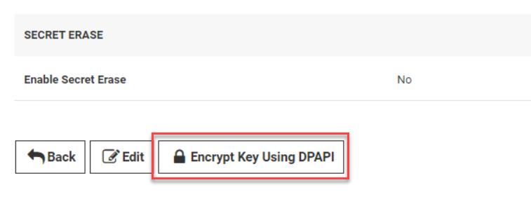
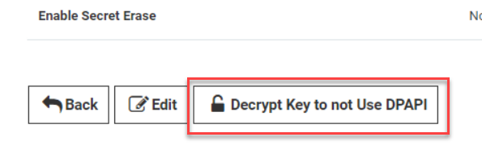
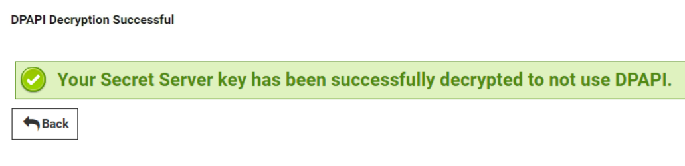
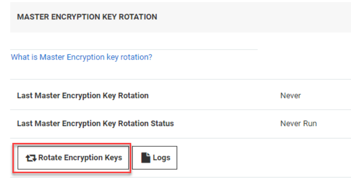
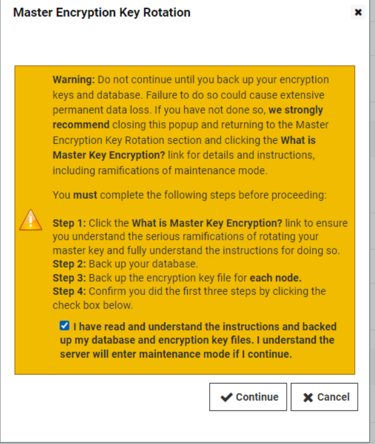
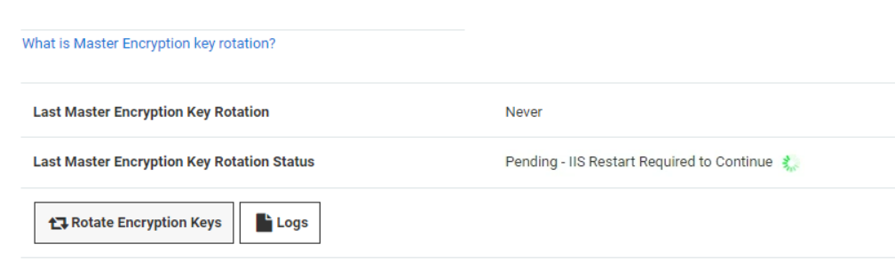
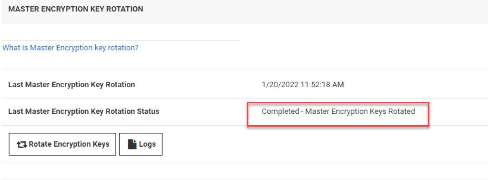

# Basic Configuration

## Introduction

This second module will cover:

1. Installing and activation of Licenses
2. Security hardening
3. Protecting the encryption key

## Basic Configuration

In this module we will explore a range of basic configuration tasks in Secret Server. Your trainer will also discuss best practices and common use cases

### Installing Licenses

Before any additional licenses are installed the free version of Secret Server (standard addition) allows for the creation of one user and has many feature limitations. In a production environment, additional licenses must be purchased, installed and activated for effective usage.

Secret server is licensed for both users and support, support licenses allow Secret Server to receive updates. The number of support licenses and user licenses must match in order to receive upgrades. Valid support licensing is required to receive any technical assistance from the Delinea support team.

#### Lab 3 - Installing Licenses

Ensure you are logged in to Secret Server with the initial account created during the installation (ss_admin / *Provided by trainer* or you have used your own)
   
!!!Note 
      The first time you open the UI, it will take some time as IIS needs to get stuff ready to be used.
   

02. Click **Administration** from the toolbar then hoover over **Setup & System Maintenance** and select **Licenses**

      

3. From the licenses page click the **Install New License** button

      

4. As we will be entering multiple license keys, select Bulk Entry Mode

5. In the license field paste the license keys provided by your Trainer, they should be in the following format

      

### License activation

Although adding these license keys has upgraded Secret Server from standard to platinum addition, Secret Server will now be in Limited Mode. To remedy this the license keys, we have added need to be activated.

Secret Server licenses are typically activated over a secure HTTPS connection but for environments with no internet access, an offline activation process is also available

During the activation the following information is sent to Delinea:

- Name (user entered)

- Phone Number (user entered)

- Email (user entered)

- All Licenses (license name, license key)

- Hardware Hash of each web server

  - This information is one way hashed before it is sent so it does not reveal any identifiable hardware information.

- Secret Server Version

- An Encrypted Value to identify the instance

  - This does not include any Secret data or the encryption.config file.

- The data is gathered for the purpose of contact if there is a licensing issue and Delinea will not sell or distribute the information provided during activation.  - The only information available to Delinea staff is the contact information solely for the purposes of technical support and customer service.

#### Lab 4 - Activating Secret Server Licenses

1. From the licensing page, click the **License Activation** button

2. Enter the default training user details as in the image below. The phone number does not need to be valid in this training environment

      

3. Click **Activate** to complete the license activation process.


4. After a few seconds the screen returns to an overview of the licenses. Clicking the **Server Activation** tab will show that the server **SSPM** is Activated.

      

!!!Note
      If the installation would be an AirGapped installation, click the Link **Need to Activate on an AirGap Network?**. The document will describe the process using a request and response method using a separate machine that can connect to the internet.

### Security Hardening

Following the installation of Secret Server, it is important to make sure that environment and installation are as secure as possible. Secret Server makes this easy by providing a report of potential security issues and easy to follow guidance on hardening configuration to mitigate risks.

The Security Hardening report can be accessed by navigating to the 

**Reports**

 tab then selecting 

**Security Hardening**

.

In this section we will view the security hardening report and perform a number of tasks to increase the security of the installation. For a full guide on hardening a Secret Server installation visit: 

<https://docs.delinea.com/secrets/current/security-hardening/security-hardening-guide/index.md>


Each item within the report represents a potential security concern that should be considered in any environment. For a detailed description of the issue and remediation actions, click *Explain*

It is important to understand that in many cases security must be balanced against user productivity. The first item in the security hardening report is a good example of this. Allow approval for access from email is a very convenient feature that allows users to approve or deny access to a secret by clicking a link in the request email. This obviously presents a security concern if the users email account is compromised. In many cases, features like this need to be considered based on the individual requirements of your organization.

#### Lab 5 – Protecting the encryption config and rotate the Master Key

As discussed in section 1.3 the master encryption key used to encrypt the Secret Server database is initially stored in plain text in the following location:

```powershell
C:\inetpub\wwwroot\SecretServer\encryption.config
```

Delinea strongly recommend that steps are taken to protect this file to prevent unauthorized access to the Secret Server database or individual secrets. Typically, there are three ways this can be achieved

- Protecting the encryption.config file with DPAPI
- Protecting the encryption.config file with EFS
- Protecting the encryption.config file with an integrated HSM

In this exercise we will use DPAPI to protect the encryption.config file. For more information on using EFS or a HSM please visit <https://docs.delinea.com/ss/11.1.0/security-hardening>

1. Ensure you are logged in to Secret Server with the account created during the installation (ss_admin / *Provided by trainer*)

2. Open a file explorer window and navigate to **C:\\inetpub\\wwwroot\\SecretServer** and copy the **encryption.config** file to your desktop.

3. Navigate to the **Administration** click the **>>** icon. In the search bar type **Configuration**

4. Select the security tab and scroll down to the bottom of the page and click the **Encrypt Key Using DPAPI** button

      

5. You will be presented with a confirmation dialogue. Check the **I have read the warning** check box

6. Enter the password for the current user (*Provided by the trainer*) and click the **Confirm** button

7. If the encryption has been completed click **Back**

      

8. Right-click the version of encryption.config exported in step 2 and open with Notepad, At the same time open the newly encrypted encryption.config file located in c:\\inetpub\\wwwroot\\SecretServer. You can now compare the unencrypted and encrypted versions side by side.

!!!Note
     Other, additional measures are recommended in securing the master encryption key used by Secret Server such as EFS encryption or offloading to a HSM. Please visit <https://docs.thycotic.com/ss/11.1.0/security-hardening> for more information.


Rotating the master key is important in most scenarios. This feature, introduced in version 11.1.x, can be used to rotate the encryption key.

01. For the rotation to take place, the encryption.config file must be in a decrypted state. To do this, click **Back**

02. Scroll down to the bottom of the page and click **Decrypt Key to not use DPAPI**

    

03. In the screen that appears, type the password for the current user and click **Confirm**

04. If the password was correct, you will see that the decrypt was successful

    

05. Click **Back**

06. Scroll down till you see the *MASTER ENCRYPTION KEY ROTATION* and click **Rotate Encryption Keys**

    

07. Click the "I have read and understand...." and click **Continue**

    

08. After that the UI will show *Pending - IIS Restart required to Continue*

    

09. Open a Elevated CMD line and run

      ```bash
      iisreset
      ```

    

10. This will stop and start the IIS server.

11. Refresh your browser after the command succeeded (it will take a minute)

12. The UI wil eventually show that the Master Encryption Key Rotated is completed

    

13. The master-encryption-key has been rotated to new values.

!!!Note
      More detailed information can be found here <https://docs.delinea.com/ss/11.1.0/security-hardening/master-encryption-key-rotation/index.md>

