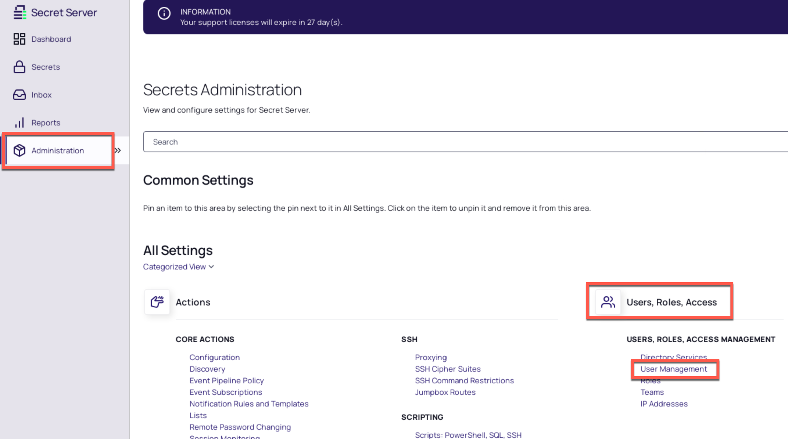

# Users, Groups and Roles

## Introduction

This third module will cover:

1. Creating Secret Server Users
2. Configure Active Directory Synchronisation
3. Creating a Local group
4. Roles

In this module we will be covering how users are created and managed within Secret Server and how role-based access control (RBAC) can be used to ensure users only have access to the areas of the application required in their specific job role.

## Creating Secret Server Users

The initial configuration we have completed so far has been performed using the initial account created during the installation of Secret Server. We now need to consider how we will provide access to other users. There are three main ways in which user access can be provided within secret server

1. **Creating local users** – User accounts can be created within secret server
2. **Active Directory Sync** – Specific users or groups of users will be able to log in to secret server using the active directory domain credentials
3. **SSO Integration** – Secret server can integrate with many single sign on providers using SAML

In this section we will create a new local user as an example and then configure Active Directory synchronization to allow existing AD users to log into Secret Server with their domain credentials.

### Lab 6 - Creating a local user

1. Ensure you are logged in to Secret Server with the account created during the installation (ss_admin / *Provided by trainer*)

2. Navigate to the **Administration > Users,Roles, Access > User Management**

3. On the intro page, click **Continue**

    

4. On the right of the page, click the **Create User** button, the **Add User** page will appear.

5. Create a new user account using the settings below or create your own local user

    - **Username:** JBloggs
    - **Display Name:** Joe Bloggs
    - **New Password:** *Provided by trainer*
    - **Confirm Password:** *Provided by trainer*
    - **Email:** <mailto:bloggs@thylab.com>
    - **Slack:** Leave Blank
    - Leave rest of the fields default, make suer **Enabled** is enabled!

    

6. Click **Add User** to create the new user account.

### Lab 7 – Configuring Active Directory Synchronization

In this exercise will set up synchronization between secret server and an Active Directory domain. This will allow specific users or groups users access to Secret Server using their Domain credentials.

01. Ensure you are logged in to Secret Server with the account created during the installation (ss_admin / *Provided by trainer*)

02. Navigate to the **Administration > Users, Roles, Access > Directory Services**

03. On the introduction screen, click **Continue**

    

04. On the right of the screen, click the **Add Domain** button

05. From the list of available directory integrations, select **Active Directory Domain**

06. When the Active Directory dialogue appears enter the following information:

    - Fully Qualified Domain Name: thylab.local
    - Friendly Name: Thylab
    - Active: Checked
    - Use LDAPS: Unchecked

07. For the Synchronization Secret, we will need to create a new secret in secret server for the credentials of an account that has read access to Active Directory. Click **Create New Secret** on the right-hand side of the dialogue

08. The new secret page should now be opened in a new tab, configure the new secret with the following information:

09. Ensure secret template is set to **Active Directory Account**

10. Make sure the folder is set to **Personal Folders/ss_admin**

11. Set Secret Name to **AD Sync**

12. Set Domain to **Thylab**

13. Set Username to **svc_sync**

14. Set Password to *Provided by trainer*

15. In the notes field, type: *Used for active directory integration and synchronization in Secret Server*

16. Your settings should now match the image below:

    

17. Click **Create Secret**

18. Click **Validate and Save**

19. Secret Server will check that the Domain can be contacted, you should now see group names. Now that the Domain has been configured, we need to identify which users or groups of users from Active Directory we want to synchronize into Secret Server.

20. From the drop-down list of available groups, select the following.

    - Secret Server Administrators
    - IT – Database Team
    - IT – Desktop Team
    - IT – Server Team
    - IT – Unix Team

      

21. Click the **Save** button

22. The Synchronize Now dialogue is displayed. Keep both **Enable Directory Services** and **Enable User Synchronization** checked

23. Click **Sync Now** (this will perform an initial, manual synchronization of all users present in the selected AD groups)

#### To AD Synchronization to run on a schedule

1. Back in **Administration > Users, Roles, Access > Directory Services**, click the **Configuration** tab.

2. The settings will match the following:

    

3. Under **User Synchronization**, click **Edit**.

4. Change the **Synchronization Interval** to run at a desired interval (default is every hour)

5. Change the **User Account Options** to **User Status Mirrors Active Directory** (this is the most commonly used option and means that whatever state a user is in within Active Directory (Enabled/Disabled) will be replicated in Secret Server)

6. Click **Save**

!!!Note
    At this point your trainer will explain Automatic user management or visit <https://docs.delinea.com/ss/11.1.0/directory-services/active-directory/understanding-ad-automatic-user-management/index.md> for more information)

## Groups

Within Secret Server groups are an important organizational container for user accounts. Although Roles (discussed in the next section) permissions and access to secrets can be determined at the individual user level, this approach can be highly complex, time consuming and difficult to manage. Adding users to groups means that configuration can then easily be applied to all users within the group while still providing the option for exceptions at the individual user level.

If Active Directory integration and synchronization have been configured, then any selected groups and group memberships from Active Directory will be replicated within Secret Server. If these groups do not provide the level of granularity required in Secret Server, local groups can also be created.

### Lab 8 – Creating a local group

1. Navigate to the **Administration > Users, Roles, Access > User Management** and click the **Groups** tab, you should see the four groups that were synced from Active Directory plus a default local group called *Everyone*

2. To create a new group, click the **Create Group** button on the right of the screen

3. Set Group name to **Checkout Approvers**

4. Ensure **Enabled** is checked and click **Create Group**

5. Click the **Add** button on the **Members** tab

6. Select **Barry Saunders**, **Hardeep Patel** and **Kim Morris**, click right bottom **Add** or drag and drop the names into the light ble bordered area to the left

    

7. Your group should now match the image below. This group will be used in later lab exercises

    

8. Close the *Add Users and Groups* area by clicking the *X*

## Roles

When users are created or synchronized into Secret Server they must be assigned to a role. This ensures that a strict role-based access (RBAC) approach can applied within secret server.

A role in Secret Server is basically a permission set. There are 117 set highly granular permissions that can be included or excluded from a role to ensure that your organization can provide each user with the specific permissions they require without creating over privileged users.

In this section we will cover the default roles available in Secret Server and how to apply roles to users or groups of users. We will also introduce several scenarios where you may want to create custom roles.

!!!Note
    By default, when users are first created or synchronized into secret server, they are assigned the **user role**. This can be changed by navigating to the **Administration > Actions > Configuration** page. Under the **User Experience** section, you will find the **Default New User Role** field. You can change this to any available role.

### Lab 9 – Applying Roles

Roles can be applied to individual user accounts or to groups. As a best practice, users should be added to groups and then roles applied at the group level. This provides a more scalable, manageable approach to role-based access control (RBAC).

We will now apply the built in Administrators role to the Secret Server Administrators group we have previously synced from Active Directory

1. Navigate to the **Administration > Users, Roles, Access > Roles** page

2. Click the **Administrator** role

3. Click the **Add** button

4. Find and select the **Secret Server Administrators**’ group

5. Click the **Add** button under the users/groups

6. Your configuration should match the image below:

    

### Lab 10 – Creating Custom Roles

Out of the box, Secret Server provides a range of Roles that satisfy many common use cases. Delinea does recommend that each customer creates custom roles based the needs of their organization

In this lab exercise we will explore a common scenario where more granular permission sets may be required.

Secret Server provides an important break glass mechanism called  **Unlimited Administration Mode**. If this administration mode is enabled, any user with a specified permission will automatically gain access to **all secrets stored in secret server, regardless of any permissions applied at the folder or individual secret level**

There are three role permissions relevant to Unlimited Administration:

- **Administer Configuration Unlimited Admin** – Users with this role permission can enable or disable unlimited administration mode
- **Unlimited Administrator** – Users with this role permission receive unlimited secret access if unlimited administration mode is enabled
- **View Configuration Unlimited Admin** – Users with this role permission can view the current administration mode configuration

As a best practice, Delinea recommends splitting the Administrator role out to ensure a least privilege approach

| User | Description | Permissions |
|------|-------------|-------------|
| Administrator (Super User) | Can configure and receive unlimited administration | Administer Configuration Unlimited Access
| | | Unlimited Administrator |
| | | View Configuration Unlimited Administrator |
| Administrator (Unlimited Admin Configure) | Can configure **but NOT** receive unlimited administration | View Configuration Unlimited Administrator |
| | | Administer Configuration Unlimited Access |
| Administrator (Unlimited Admin User) | Can receive **but NOT** configure unlimited administration | Unlimited Administrator |
| | | View Configuration Unlimited Administrator |

01. Navigate to the **Administration > User, Roles, Access > Roles** page

02. Click the **Administrator** role

03. On the *General* tab click the **Edit** text

04. Change the name to **Administrator (Super User)**

05. Click **Save**

06. Navigate back to **Administration > User, Roles, Access > Roles**

07. Click the **Create Role** button on the right of the screen

08. Enter a role name **Administrator (Unlimited Admin Configure)**

09. Click **Create Role**

09. Click the *Permissions* tab and click the **Add** text

10. Select all the permission, using the Select All text on the right hand side, drag them in the left hand side and remove, the below permissions:

    - Access Offline Secrets on Mobile
    - Allow Access Challenge
    - Privilege Manager Administrator
    - Privilege Manager Helpdesk User
    - Privilege Manager MacOS Admin
    - Privilege Manager Unix/Linux Admin
    - Privilege Manager User
    - Privilege Manager Windows Admin
    - Unlimited Administrator
    - Web Services impersonate

11. Click **Save**

12. Repeat the above steps for the **Administrator (Unlimited Admin User)** where all permissions are included apart from the following:

    - Access Offline Secrets on Mobile
    - Administer Configuration Unlimited Admin
    - Allow Access Challenge
    - Privilege Manager Administrator
    - Privilege Manager Helpdesk User
    - Privilege Manager MacOS Admin
    - Privilege Manager Unix/Linux Admin
    - Privilege Manager User
    - Privilege Manager Windows Admin
    - Web Services impersonate

13. Click **Save**

14. Return to **Administration > User, Roles, Access > Roles** page and click the **Administrator (Super User)** role

15. Hover over the thylab.local Secret Server Administrators group and click the **delete icon**

    

16. Return to **Administration > User, Roles, Access > Roles** page and click the **Administrator (Unlimited Admin Configure)** role

17. Click the **Add** button and add **Sarah Tate**

18. Return to **Administration > User, Roles, Access > Roles** page and click the **Administrator (Unlimited Admin Configure)** role

19. Click the **Add** button and add **Tom Smith**

#### Check role assignment

1. To check the role assigment, click **Administration > User, Roles, Access > User Management**

2. click on account names **STate** and click the **Roles** Tab. This shows the assigned roles and should correspond with the steps above for Sarah Tate

    

3. Repeat the steps for Tom Smith (TSmith) and check that his roles are also correct.
