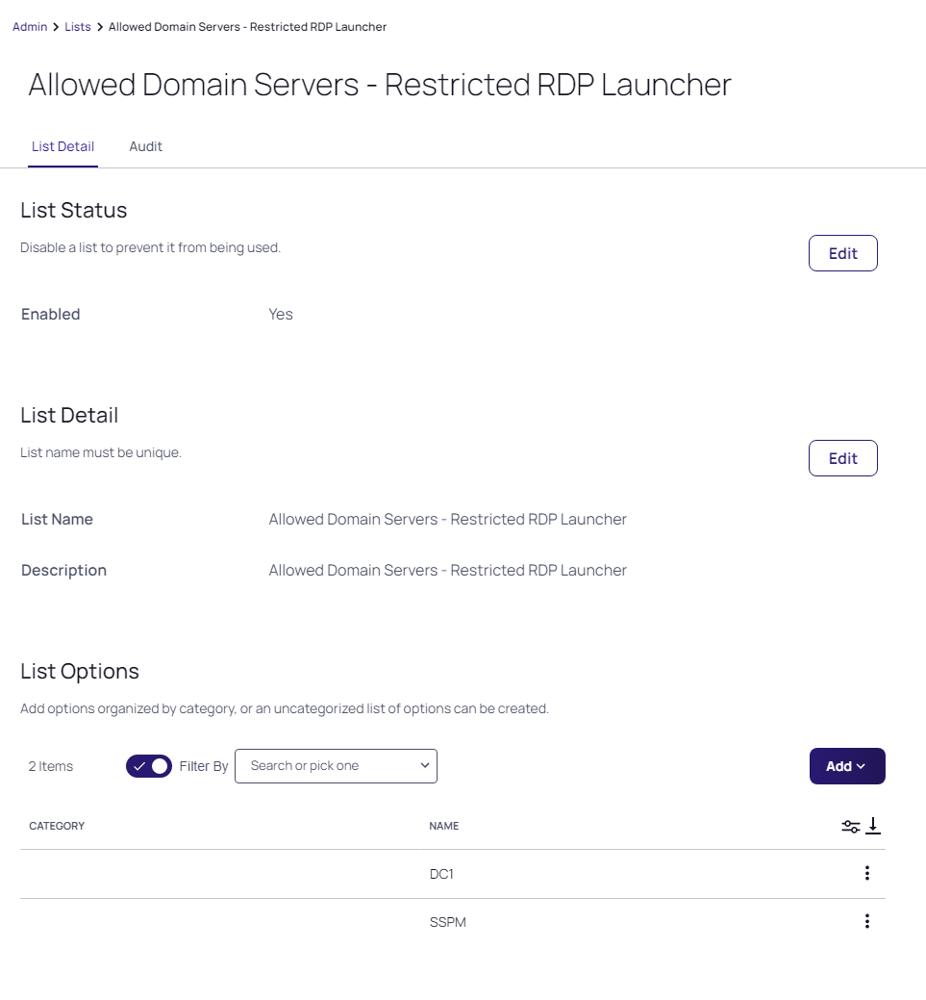
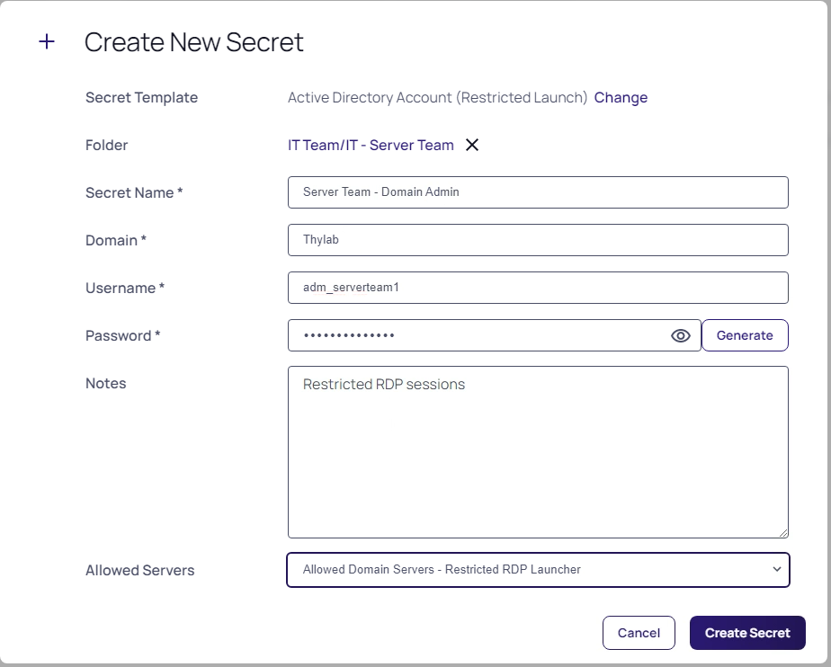
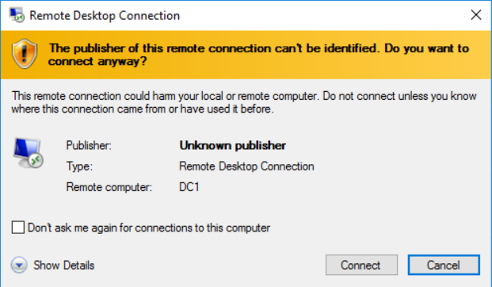
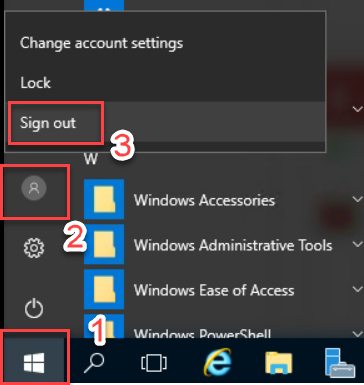
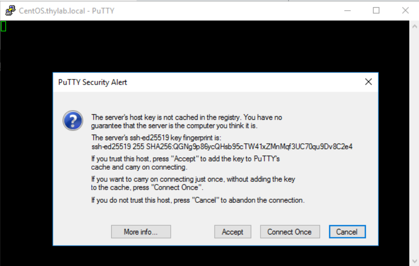

# Launchers

## Introduction

This sixth module will cover:

1. Launchers overview
2. Creating launchers (ssh)
3. Custom launchers
4. Create custom launchers

## Launchers overview

Secret Server provides the ability to launch remote desktop or SSH sessions, run applications or log into web pages directly, using the credentials from a secret. This provides users with a 'single pane of glass' where they not only have access to all credentials required for a role but also all the tools necessary to perform tasks using the credentials.

The biggest benefit of launchers aside from this efficiency gain is that because Secret Server can seamlessly inject the credentials into the session, application or website, the user never needs visibility of the username and password. This means that passwords can be hidden from users, which, in turn provides a whole range of benefits:

- Prevents users from circumnavigating audit trails or monitoring from Secret Server or other security tools
- Prevents users from sharing credentials with non-authorized parties
- Allows for highly complex passwords as users don't need to remember or input them
- Allows for regular password rotation

Out of the box, Secret Server provides the following launchers:

- Remote Desktop
- PuTTy
- Website Login
- Powershell Launcher
- SQL Server Management Studio Launcher
- Sybase isql Launcher
- z/OS Launcher
- IBM iSeries Launcher

In addition to these 'out of the box' launchers, custom launchers can be created to execute any process that can be executed from the command line. Secret Server can pass secret text fields such to seamlessly run applications with a range of command line arguments.

!!!Note
    Your trainer will now demonstrate a number of built in launchers and explain their functionality

### Lab 14 - Creating a restricted RDP launcher

The built-in remote desktop launcher allows the user to enter the hostname, fully qualified domain name (FQDN) or IP address of a target machine they want to connect to. In some scenario's users may not know this information or we may only want them to able to connect to a defined list of endpoints. In this scenario a modified RDP launcher can be created with a defined list of target endpoints.

As launchers are linked to a secret template, the first step is to create a new template to contain the launcher

!!!Note
    This lab exercise should be performed from the client lab machine (Client)

1. Navigate to the **Administration (double arrows) > Actions > Secret Templates**

2. Click **Active Directory Account**

3. Click **Edit**

4. Click **Duplicate**

5. Name the new template: *Active Directory Account (Restricted Launch)*

6. Click **Save**

7. Click the **Fields** tab

8. Create a new Field using the **Add Field** button and use the following parameters:

   - **Name:** Allowed Servers
   - **Field Slug Name:** allowed-servers (auto populated)
   - **Description:** These servers are allowed to connect to
   - **Data Type:** List (has to be list otherwise we can not select it for restriction)
   - Click **Save**

Now we can configure a modified RDP launcher for the new template

1. Click the **Mapping** tab

2. In the *Launchers* section, click **Edit** next to the *Launcher Name*

3. Leave all basic settings as they are

4. Under *Launcher Restrictions* click **Edit**

5. Ensure the following settings are configured:

   - **Restrict User Input:** Checked
   - **Use List Fields:** Allowed Servers (from the dropdown box)
   - **Deny List:** None
   - **Include machines from dependencies:** Unchecked

6. Click **Save**

!!!Note
       This configuration means that the user will be presented with a list of endpoints to connect to that will be held in the Notes field of the secret. To test the new template and launcher we will create a secret to launch from in a few.

#### Creating a List to be used by the template

To be able to use a list, dropdown as defined by the template (*Allowed Servers of the list type*), we need to create it.

1. Navigate to **Administration (double arrows) > Actions > Lists**

2. Click **Create List**

3. Use the following parameters for the fields:

   - **Name:** Allowed Domain Servers - Restricted RDP Launcher
   - **Description:** Allowed Domain Servers - Restricted RDP Launcher

4. Click **Save**

5. Click the **Add** button in the *List Options* and select **Create Option**

    

    !!!Note
        Categories can be created as well to organize the lists (select Create Category). Example; webservers - so you can make the list available using this category. For this training we are going to use the Uncategorised category

6. In the **Option Name:** type *DC1* and click **Save**

7. Repeat the above *DC1* step for **SSPM**

8. Your List should look like below:

    

#### Create a secret using the new Secrets Template

01. Navigate to **Secrets (double arrows) > IT Team > IT – Server Team**

02. Click the **+** icon in the top right corner, to create a new secret in this folder

03. The *Create New Secret* Dialogue appears

04. Select **Active Directory Account (Restricted Launch)** as the template

05. Configure the secret with the following settings:

    - **Name:** Server Team - Domain Admin
    - **Domain:** Thylab
    - **Username:** adm_serverteam1
    - **Password:** *Privided by the Trainer*
    - **Notes:** Restricted RDP Sessions
    - **Allowed Servers:** Allowed Domain Servers - Restricted RDP Launcher (from the dropdown box)

06. Your configuration should match the image below:

    

07. Click **Create Secret**

08. To test our configuration, open the secret

09. Because of the Secret Policy configured earlier at folder level (module 4), this secret will require comment and checkout. Provide a reason like *Training lab* and click **Check Out secret**

10. Click the **RDP Launcher**

11. Select **DC1** from the dropdown box (you will only see *DC1* or *SSPM*) and click **Launch Now**

    !!!Note
        If this is the first time the user has opened a Secret Server launcher they will prompted to download and install the Delinea Protocol Handler:

        

12. Download and install the 64bit version

13. Once installed, click the **Cancel** button

14. Relaunch the RDP Launcher for the DC1

15. Windows will now prompt the following warning message. Click **Open RDPWinBootsrapper**

    

16. This will open a new screen, click **Yes**

    

17. If you receive the following certificate warning in the lab, click **Connect** to proceed:

    

18. Your RDP session should now be launched and automatically logged in.

19. Close the RDP session. For now we don't need it anymore.

    

### Lab 15 – Creating a Unix SSH (PuTTY) Launcher

01. Navigate to **Secrets (double arrows) > IT Team > IT – Unix Team**

02. Click the **+** icon in the top right corner, to create a new secret in this folder

03. The *Create New Secret* Dialogue appears

04. Select **Unix Account (SSH)**

05. Configure the secret with the following settings:

    - **Name:** Unix Root Account
    - **Machine:** Centos
    - **Username:** centosuser
    - **Password:** *Provided by Trainer*
    - **Notes:** leave blank

06. Select checkbox to generate SSH key

07. Private Key Passphrase: **Hide**

08. Your configuration should match the image below:

    

09. Click **Create Secret**

10. Launch the **PuTTY Launcher**

11. Windows will now prompt the following warning message. Click **Open RDPWinBootsrapper**

    

12. In the PuTTY window a warning will be shown. Click **Accept**

    

13. You should now have the *centosuser* logged in in the PuTTY screen.

    

14. Logout of the PuTTY session using **CTRL+D**. This will close the session.

## Custom Launchers

Secret Server can configure a program to run when clicking the launcher on a secret. You can customize process launchers to work with any application that can be started by command-line and passes values to the command-line from the secret text fields. For process launchers to work, the client machine needs to have the program installed and typically needs the program folder in the PATH environment variable.

There are three types of custom launchers to choose from:

- **Process:** Launch a process on the client machine that connects directly to the target system from the client.
- **Proxied SSH Process:** Launch a process on the client machine that proxies its connection to the target system through SS.
- **Batch File:** Launch a batch file from the client machine.

### Lab 16 – Creating a custom Launcher

The first step to configuring remote password changing is to enable the feature in configuration:

1. Navigate to the **Administration (double arrows)> Actions > Secret Templates**

2. Click the **Launchers** tab in the to of the screen, and then click **Create**.

3. Select **Process** for the **Launcher Type**, and then type for the *Launcher Name* **Notepad**

4. Under the *WINDOWS SETTINGS*

    - **Process Name:** C:\\Windows\\System32\\notepad.exe

        !!!Note
             If your process requires extra arguments, type them in **Process Arguments**. To reference a Secret field, type **\$** followed by the name of the relevant Secret field. For example, **/A \$FILENAME** *where filename is the name of a Secret field name on a Secret template that will be used with this Launcher*.

    - **Run Process As Secret Credentials**

        the process authenticates with the secret credentials (username, domain, and password) instead of the client user that is using the launcher. This can be overridden at the secret level to use a privileged account to run the process.

    - **Use Operating System Shell:**

        Use the OS shell for the launcher. Useful for processes requiring UAC confirmation

    More detailed information can be found at <https://docs.delinea.com/ss/11.1.0/secret-launchers/custom-launchers/creating-custom-launchers>
   

5. Your Launcher should look like

    

6. Click **Save**

### Lab 17 - Adding a custom launcher to a Secret template

1. Navigate to the **Administration (double arrows)> Actions > Secret Templates**

2. Select the **Active Directory Account (Restricted Launch)** template

3. Click the **Add Mapping** button

4. Select **Notepad** as the *Mapping Type*

    

5. Map Domain, Password, and Username to the corresponding fields in the template. These will be used if you have chosen to run the Launcher as the Secret credentials.

    

6. Click **Save**

7. There will now be two different launchers. The below screenshot should be seen in your Secret Template

    