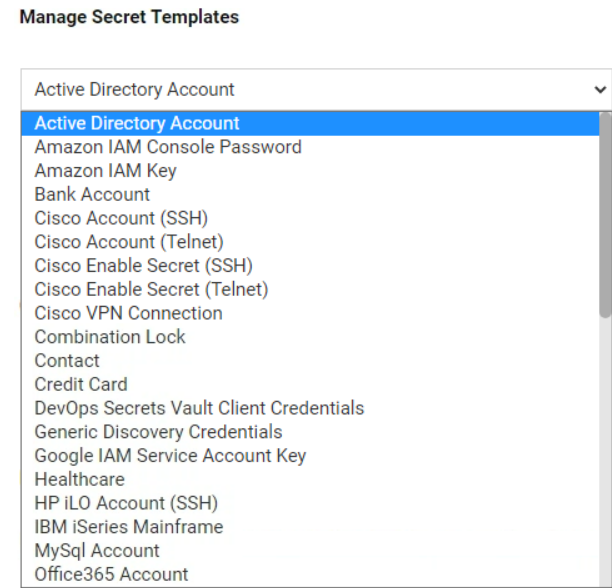

.. _m5:

----------------
Secret Templates
----------------

Introduction
------------

This fifth will cover:

1. Discuss built-in Secret Templates
2. Create a Secret Template

Built-In Secret Templates
-------------------------

When creating new secrets, a template is used to determine what information the secret should hold, password complexity requirements, launcher configuration and many other secret settings

| Secret Server comes with a range of built-in secret templates. These templates can be viewed and edited by navigating to Admin>Secret Template and selecting the relevant template:

.. note::
    Demo: At this point your trainer will demonstrate and explain the available configuration options within a Secret Template

Lab 13 - Creating a Secret Template for Active Directory Service Accounts
*************************************************************************

In this exercise we will be creating a Secret template that can be used for Active Directory service accounts. This template will be the same as the regular AD template, but we will remove the launcher. Because service accounts are used to provide a security context to an application, users should not be able to use the account interactively with a launcher.

| As, in this case the Secret Template we are creating is very similar to the existing Active Directory account template we will create a copy rather than starting from scratch.

#. Navigate to the **Admin > Secret Templates** page
#. Make sure **Active Directory Account** is selected in the template drop-down menu 
#. Click **Edit**

   .. figure:: images/lab-ss-002.png

#. Click the **Copy Secret Template** button, 
#. In the name new secret dialogue type: Active Directory Service Account

   .. figure:: images/lab-ss-004.png

#. Click **OK** and **Continue**
#. In the new template select **Configure Launcher**

   .. figure:: images/lab-ss-005.png

#. Click **Delete** and accept the following warning prompt

   .. figure:: images/lab-ss-007.png
 
We will now use this template to recreate the secret used Active Directory integration.

#. Navigate to the **Home > Secret** screen
#. Select the **TSS Service Accounts** folder
#. Click the **+** Icon next *Secrets* (highlighted in the image below):

   .. figure:: images/lab-ss-008.png

#. The new secret dialogue appears, select the newly created **Active Directory Service Account** template
#. Add the following detail into the secret:

   - **Secret Name:** AD Sync
   - **Domain:** thylab.local
   - **Username:** svc_sync
   - **Password:** *Provided by Trainer*
   - **Notes:** type used for active directory integration and synchronization in Secret Server

#. Click **Create Secret**

  .. note::
     The new secret we have created does not have an RDP launcher so users cannot interactively use the credential from Secret Server. 

We can now delete the first AD Sync secret from the Ss_admin personal folder

#. From the home screen, expand personal folders
#. Select **ss_admin**
#. Check the box next to the **AD Sync** secret 
#. Click the trashcan icon to deactivate

   .. figure:: images/lab-ss-009.png

#. In the *Confirm Bulk Deactivate* windows click **Confirm Action**
#. After the task completed, click **Close**

   .. figure:: images/lab-ss-010.png

#. No secrets will be left in this folder
#. Now navigate to **Admin > Directory Services**
#. Select the **thylab.com** domain 
#. Click **Edit** next to *Active Directory*
#. Next to **Synchronization Secret**, click Clear to remove the secret we previously deleted (AD Sync (Deleted))
#. Click **No Secret Selected** and select the new **AD Sync** secret in the *TSS Service Accounts* folder
#. Click **Save and Validate** to complete

.. raw:: html

    

    <H2 style="color:#80BB01">This concludes this module
    
